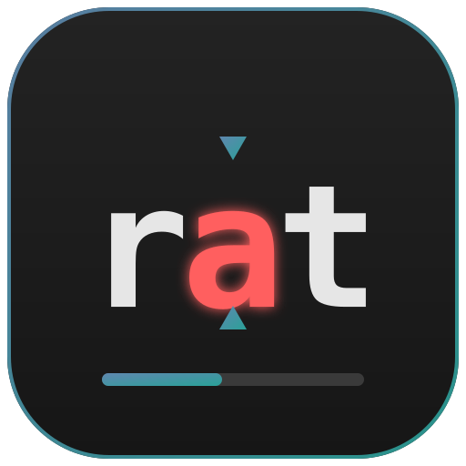

<p align="center">
  
</p>

<h1 align="center">rat</h1>

A `cat` for people in a hurry. Instead of dumping a file to your terminal, `rat`
plays it back as a **speed reader** — flashing one small chunk of words at a
time in a fixed position, so your eyes never move and your mind sets the pace.

It uses the two classic RSVP (Rapid Serial Visual Presentation) techniques:

- **Fixed-position display** — words appear in one place, a "gaze anchor", so
  you spend no effort tracking across lines or jumping back to the next one.
- **Optimal Recognition Point (ORP)** — the pivot letter, slightly left of
  centre, is highlighted in a second colour, and each word is shifted so that
  pivot always lands in the same column. (Popularised by *Spritz*.)

```
                  ▼
              R e c o g n i t i o n
                  ▲

  ████████████████░░░░░░░░░░░░░░░░░░░░░░░░░░░░
  ▶  300 wpm · 128/1204 · 11% · dark · adaptive
  ? help
```

> [!NOTE]
> **`rat` is an AI-first codebase.** It was designed, written, tested,
> documented, and maintained almost entirely by an AI coding agent (Anthropic's
> Claude, via Claude Code), working from human prompts with a human directing the
> work and reviewing/approving each change. It's shared, in part, as an honest
> example of AI-led development — worth keeping in mind when reading the code or
> weighing it for production use.

## Install

### Prebuilt binary (recommended)

Grab the archive for your platform from the
[latest release](https://github.com/pdaigneault/rat/releases/latest). Binaries
are provided for **linux**, **macOS** (darwin) and **windows**, on **amd64** and
**arm64**.

macOS / Linux — download, extract, and put `rat` on your `PATH`:

```sh
VERSION=1.0.0
OSARCH=linux_amd64   # or: linux_arm64, darwin_arm64, darwin_amd64
curl -sSL "https://github.com/pdaigneault/rat/releases/download/v${VERSION}/rat_${VERSION}_${OSARCH}.tar.gz" \
  | tar -xz rat
sudo mv rat /usr/local/bin/
rat --version
```

Windows: download `rat_<version>_windows_amd64.zip` from the releases page, unzip
it, and add `rat.exe` to your `PATH`.

Each release also ships a `checksums.txt` if you want to verify the download.

### With `go install`

Requires **Go 1.25+** (the Charm v2 TUI libraries set this floor):

```sh
go install github.com/pdaigneault/rat@latest
```

(Available from **v1.1.1** onward — the first release carrying the module path
that matches this repo.)

### From source

Clone the repo and use the Makefile:

```sh
git clone https://github.com/pdaigneault/rat.git
cd rat
make install    # build + install into $GOBIN (or $GOPATH/bin)
# or just build locally without installing:
make build      # produces ./bin/rat
```

## Usage

```sh
rat [flags] [file]
cat file.md | rat [flags]
```

Give it a file, or pipe text in. When you pipe, `rat` reads the document from
stdin and takes keyboard control from your terminal (`/dev/tty`), so the
controls still work.

Run `rat` with **no file and no pipe** and it opens on an empty screen — press
`f` to bring up a built-in file picker (filtered to supported types) and choose
what to read. You can also press `f` at any time to open a different file.

Input format is chosen by extension: `.txt`/`.text` are read as plain prose,
everything else is parsed as **markdown** — syntax is stripped to clean prose,
and code blocks, code spans, tables, images and raw HTML are skipped. Link text
is kept; the URL is dropped.

### Flags

Flags override your saved config for that run (they are not persisted; in-reader
changes are — see below).

| Flag         | Description                                            |
|--------------|--------------------------------------------------------|
| `--wpm N`    | words per minute, 100–1000                             |
| `--chunk N`  | words per flash, 1–3                                    |
| `--theme S`  | `dark`, `light`, `solarized`, or `high-contrast`       |
| `--adaptive B` | `true`/`false` — pacing that pauses at punctuation   |
| `--version`  | print version and exit                                 |

```sh
rat --wpm 450 --chunk 2 --theme solarized notes.md
```

## Controls

| Key             | Action                                    |
|-----------------|-------------------------------------------|
| `space`         | play / pause (restarts when finished)     |
| `←` / `→`       | seek back / forward one chunk             |
| `shift+←` / `→` | jump back / forward one sentence          |
| `home` / `r`    | restart from the beginning                |
| `↑` / `↓`       | speed up / down by 25 wpm (clamped)       |
| `[` / `]`       | fewer / more words per flash (1–3)        |
| `t`             | cycle colour theme                        |
| `a`             | toggle adaptive pacing                    |
| `f`             | open the file picker to choose a document |
| `?`             | toggle the help footer                    |
| `q` / `ctrl+c`  | quit                                      |

Press `?` in the reader for the full list at any time.

## Adaptive pacing

With adaptive pacing on (the default), `rat` doesn't read like a metronome. On
top of the base per-word time it:

- lingers on chunks containing a **long word** (extra registration time),
- adds a short rest at a **clause** boundary (`, ; : —`),
- adds a longer rest at a **sentence** boundary (`. ! ?`).

The result reads with the natural rhythm of the prose. Toggle it with `a` to
feel the difference.

## Configuration

Preferences live in an XDG TOML file:

```
~/.config/rat/config.toml    # honours $XDG_CONFIG_HOME
```

Every in-reader change to speed, chunk size, theme, or adaptive mode is saved
**immediately**, so your choices survive even an abrupt exit. A missing file is
not an error — defaults are used and written lazily. Example:

```toml
wpm = 350
chunk_size = 1
theme = "light"
adaptive = true
```

Defaults: `wpm 300`, `chunk_size 1`, `theme dark`, `adaptive true`.

## Development

```sh
make help        # list all targets
make build       # compile ./bin/rat
make run         # build and play testdata/sample.md
make test        # unit tests
make check       # fmt-check + vet + test (CI gate)
make cover       # test coverage summary
make fmt         # gofmt -w .
make tidy        # go mod tidy
make clean       # remove build artefacts
```

### Project layout

```
main.go                     flags, input resolution (file / piped stdin + /dev/tty), program wiring
internal/
  parser/                   document → prose Token stream (Parser interface; markdown + plain text)
  reader/                   ORP pivot, chunking, and the adaptive timing engine
  theme/                    colour palettes and live cycling
  config/                   XDG TOML load / save with clamping
  tui/                      Bubble Tea model, keys, and rendering
testdata/sample.md          fixture for manual runs and tests
```

The `parser.Parser` interface and the `config.Config` struct are the seams kept
deliberately thin so future work — more formats (PDF/EPUB), reading bookmarks —
stays cheap to add.

### Built with

[Bubble Tea](https://charm.land) · [Lip Gloss](https://charm.land) ·
[Bubbles](https://charm.land) · [goldmark](https://github.com/yuin/goldmark) ·
[BurntSushi/toml](https://github.com/BurntSushi/toml) ·
[adrg/xdg](https://github.com/adrg/xdg)

## Releases

`rat` follows [Semantic Versioning](https://semver.org) and releases are
automated with [release-please](https://github.com/googleapis/release-please)
and [GoReleaser](https://goreleaser.com), driven by
[Conventional Commit](https://www.conventionalcommits.org) messages.

The flow:

1. Merge feature PRs to `main` using Conventional Commit titles
   (`feat:` → minor bump, `fix:` → patch, `feat!:`/`BREAKING CHANGE` → major).
2. A bot keeps an open **"chore(main): release x.y.z"** pull request up to date,
   accumulating the version bump and `CHANGELOG.md` entries.
3. **Merge that release PR** when you want to ship. That tags `vX.Y.Z`, publishes
   the GitHub Release with notes, and GoReleaser attaches cross-compiled binaries
   (linux/macOS/windows, amd64/arm64) plus checksums.

Grab a prebuilt binary from the
[Releases page](https://github.com/pdaigneault/rat/releases), or build from
source (see [Install](#install)).

## License

Released under the [MIT License](LICENSE) — © 2026 Paul Daigneault.
